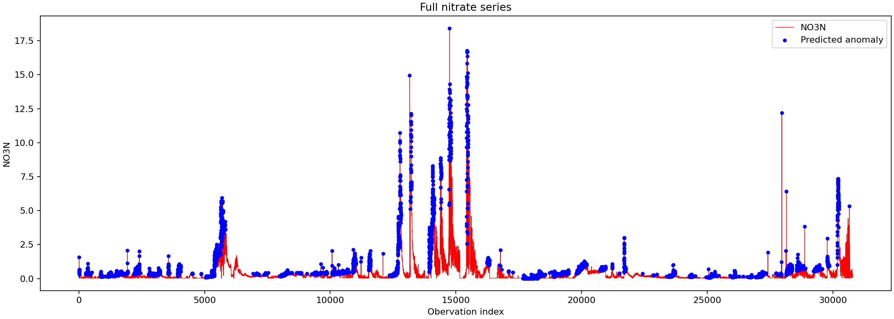

# HW2

## Running the code
1. Download this repository and open a terminal in the downloaded folder.
2. Install the libraries:
pip install numpy pandas matplotlib

3. Run the Python script:
python anomaly_detection.py

Keep the csv file in the same folder with the python code. 

## Method

I used overlapping sliding windows to detect anomalies in the nitrate data. The nitrate values are in the 'NO3N' column, and the actual labels are in 'Student_Flag'.

The window size is 500, and the threshold is the 90th percentile of each window, calculated using NumPy's linear method.

Values greater than or equal to the threshold are labeled as anomalies. This is an upper-tail rule, so low values are not marked as anomalies.

For the first window, I calculated one threshold and used it to label all 500 points. After that, I moved the window forward one row at a time, recalculated the threshold, and labeled only the new point.

## Why W = 500 and q = 90

I tried different window sizes and percentiles to see how they affected the two accuracies.

With W = 500, q = 80 detected more anomalies but also marked too many normal points as anomalies. at q=95, normal accuracy improved, but anomaly accuracy fell below 75%.

I chose W = 500 and q = 90 because this combination met both targets. A smaller window also lets the threshold adjust more quickly when nitrate levels change. 

The first threshold comes from the first 500 values. W and q stay the same throughout the series, but the threshold is recalculated for every window. 

I used the provided labels to compare these settings, so these results apply to this dataset. 

## Results

The dataset has 30,790 observations including 141 anomalies and 30,649 normal points. Each row with 'Student_Flag = 1' is counted as one anomaly.

|Metric| Meaning | Count|
|---|---|---|
|TP| Actua anomaly predicted as anomaly | 107 |
|FP| Actua normal predicted as anomaly | 4,681 |
|FN| Actual anomaly predected as normal | 34 |
|TN| Actual normal predicted as normal| 25,968|

**Normal accuracy:**
**TN / (TN + FP) = 25,968 / 30,649 = 84.73%**

**Anomaly accuracy:**
**TP / (TP + FN) = 107/141 = 75.89%**

Both results meet the required targets of 80% normal accuracy and 75% anomaly accuracy. However, there are still 4,681 false positives, which means meeting the target does not mean every detected point is an actual anomaly.

## Plot

The plot shows the full series. The marked points are predicted anomalies, including false positives.

## Data Handling

The cleaned CSV has no missing nitrate values or labels. the code checks for missing values and stops if it finds any. 

Only the values inside the current Window are used to calculate its threshold. 'Student_Flag' is used to evaluate the predictions, not to calculate thresholds.